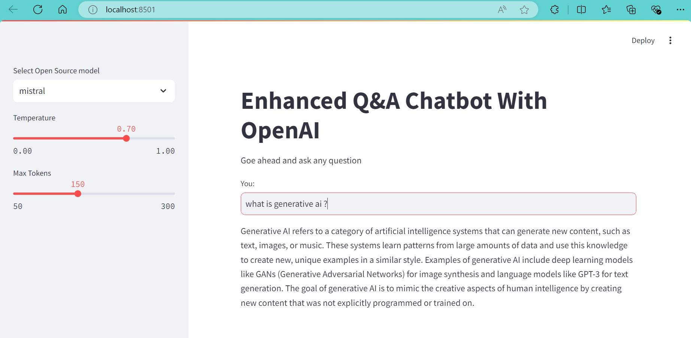

# Simple Chat Bot Using Open Source LLM Model

This repository contains a simple chatbot application developed using Streamlit and an open-source LLM model. The chatbot is designed to interact with users and provide helpful responses to their queries.

## Table of Contents

- [Features](#features)
- [Technologies Used](#technologies-used)
- [Installation](#installation)
- [Usage](#usage)
- [Code Overview](#code-overview)
- [Environment Variables](#environment-variables)
- [Results](#results)

## Features

- User-friendly interface built with Streamlit.
- Integration with the Ollama open-source LLM model.
- Adjustable parameters for response generation (temperature and max tokens).
- Environment variable management for sensitive information.

## Technologies Used

- [Streamlit](https://streamlit.io/) - For creating the web application.
- [OpenAI](https://openai.com/) - For language model integration.
- [LangChain](https://langchain.com/) - For handling prompt templates and output parsing.
- [Ollama](https://ollama.com/) - Open-source LLM model.
- [Python](https://www.python.org/) - Programming language used.

## Installation

1. Clone the repository:
   ```bash
   git clone https://github.com/Lonishubh48/simple-chat-bot.git
   cd simple-chat-bot
   ```
2. Create a virtual environment and activate it:
   ```bash
     conda create -p <your env_name> python==<version>
     conda activate <your env_name>
    ```
3. Install the required packages: create a requirements.txt file and keep all the required library 
   ```bash
      pip install -r requirements.txt
   ```
4. Set up environment variables. Create a .env file in the root directory of the project and add your Langchain API key:
   ```bash
      LANGCHAIN_API_KEY="************"
      LANGCHAIN_PROJECT="************"
      GEN_API_KEY="***********"
      HF_TOKEN="**************"
   ```
## Usage
To run the application, execute the following command in your terminal:
    ```bash
      streamlit run app.py
    ```
## Code Overview

The main logic of the chatbot is implemented in `app.py`. Here’s a brief overview of the code:

- **Imports**: Necessary libraries are imported, including Streamlit and LangChain.
- **Environment Variables**: Loaded using `dotenv` to manage sensitive information.
- **Prompt Template**: A template is created to structure the interaction between the user and the chatbot.
- **Response Generation**: A function that takes user input and generates a response using the selected LLM model.
- **Streamlit Interface**: The user interface is built with Streamlit, allowing users to input questions and receive answers.

## Environment Variables
  Make sure to set the following environment variables in your .env file:
   ```bash
      LANGCHAIN_API_KEY="************"
      LANGCHAIN_PROJECT="************"
      GEN_API_KEY="***********"
      HF_TOKEN="**************"
   ```
## Results

Here are some examples of the chatbot's responses:

- **User:** hi
  - **Assistant:** Hello! How can i assit you today.

- **User:** What is generative ai ?.
  - **Assistant:** Generative Al refers to a category of artificial intelligence systems that can generate new content, such as text, images, or music..

  

